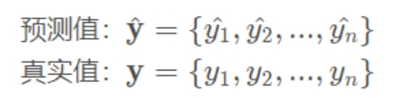
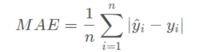
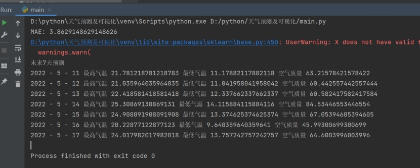
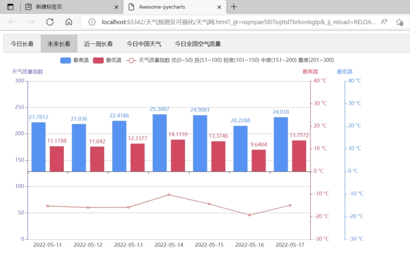
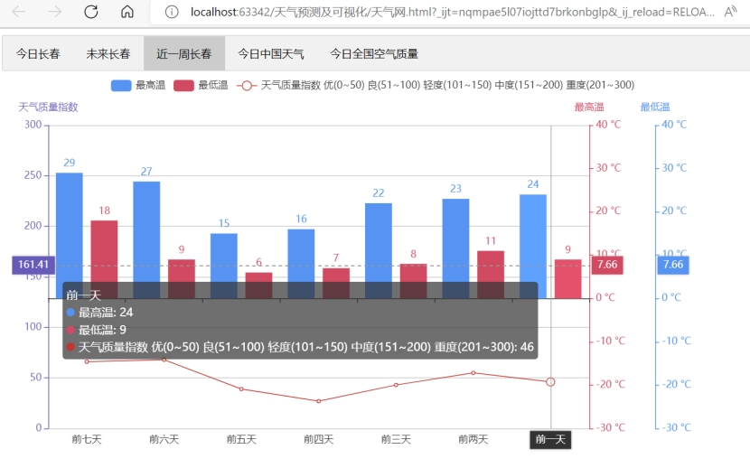
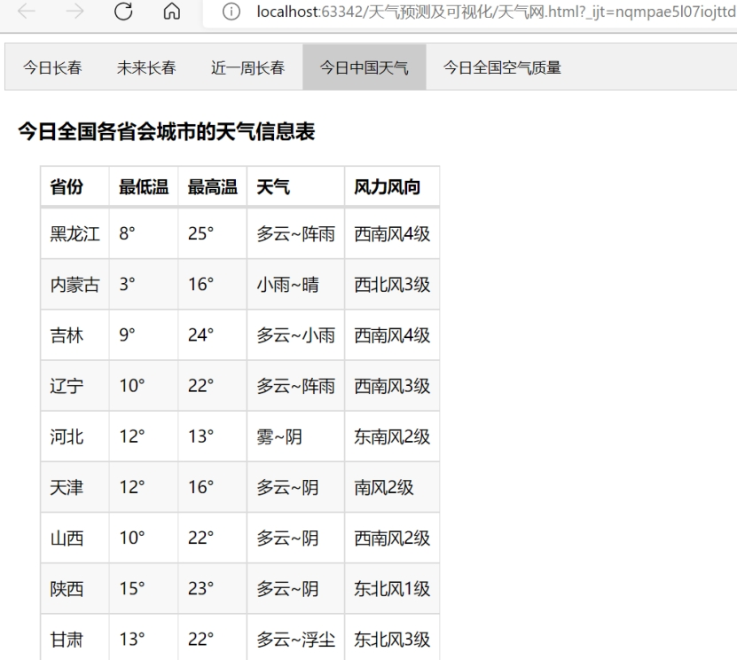
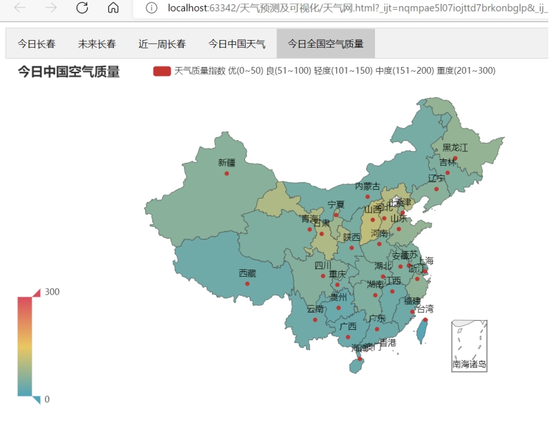
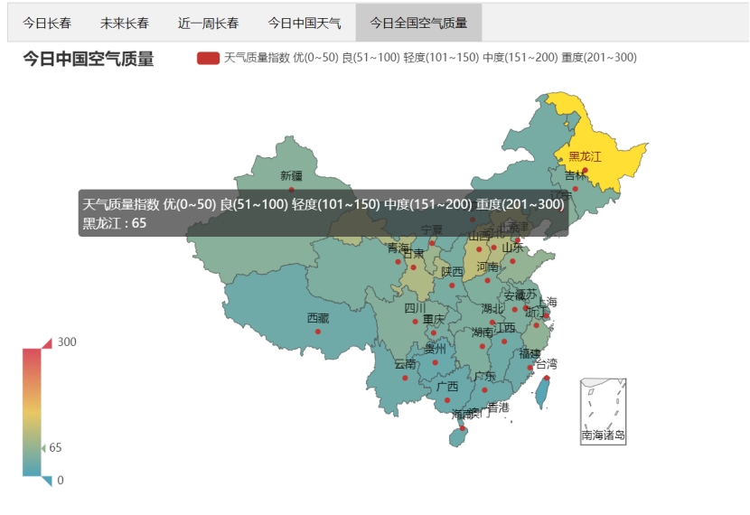

# 一、项目介绍

**项目名称：天气预测和天气可视化**

天气预测和天气可视化是一个基于python机器学习(ml)的长春地区的天气预报项目，它实现了天气数据的爬取，预测和可视化。

项目结构如下：


* 天气数据的来源

GetData文件使用python爬虫技术,爬取长春和全国的天气信息数据

爬取网站：http://tianqi.2345.com/wea_history/54161.htm

ProcessDate文件对爬取的天气数据进行了预处理

几个CSV文件保存的是爬取后并经过处理的数据


* 天气数据的预测

GetModel文件通过训练预测模型来预测长春近一周的天气，该文件利用Joblib将模型保存到本地

Main文件是项目主文件，通过运行该文件即可运行整个项目，该文件前部分获取保存到本地的预测模型来进行预测，并将预测结果打印到控制台


* 天气数据的可视化

Main文件后部分实现了天气数据的可视化


# 二、详细介绍

本项目分为三个部分，即爬取和处理数据，数据预测（包含评价方法）和数据可视化

## 1. 爬取和处理数据

数据爬取代码：

````py
resq = requests.get(url, headers=headers, params=params)
data = resq.json()["data"]
# data frame
df = pd.read_html(data)[0]
````

即使用python爬取网站的json数据

### **数据预处理：**

获取到的天气信息包括最高温，最低温都不是int格式的数字，通过对数据截取，将部分指标的数据变换为int类型

并对缺失值进行了处理

````py
my_imputer = SimpleImputer()
imputed_X_train = pd.DataFrame(my_imputer.fit_transform(X_train))
imputed_X_valid = pd.DataFrame(my_imputer.transform(X_valid))
````

通过SimpleImputer ，可以将现实数据中缺失的值通过同一列的均值、中值、或者众数补充起来，本项目使用了SimpleImputer的fit_transform对缺失值进行填充


## 2. 数据预测和模型评价方法

预测数据采用了机器学习算法——线性回归
模型使用过程：

### A. 提取数据

````py
 获取测试集、训练集、验证集
[X_train, X_valid, y_train, y_valid, X_test] = ProcessData.ProcessData()
````

其中ProcessData()函数里使用了如下语句：

````py
X_train, X_valid, y_train, y_valid = train_test_split(X, y, train_size=0.8, test_size=0.2, random_state=0)
````

train_test_split()是sklearn包的model_selection模块中提供的随机划分训练集和验证集的函数；使用train_test_split函数将完整的数据集和验证集以同等的比例分成2组不同的数据集和验证集

### B. 训练模型

选择了随机树森林模型(randomforest)，然后用fit来训练模型

````py
# 随机树森林模型
model = RandomForestRegressor(random_state=0, n_estimators=1001)
# 训练模型
model.fit(X_train, y_train)
````

### C. 根据数据预测

````py
# 最终预测结果
preds = model.predict(r[1])
````

### D.  **模型评价方法**

````py
# 用MAE评估
score = mean_absolute_error(y_valid, preds)
````

对于评估模型准确率的评价方法，本处使用的是MAE，也就是mean_absolute_error 平均绝对误差，就每个预测的数值离正确数值错误数值的平均数

假设：



平均绝对误差（Mean Absolute Error）等于：



范围[0,+∞)，当预测值与真实值完全吻合时等于0，即完美模型；误差越大，该值越大。在本项目中：

MAE: 3.8629148629148626


## 3. **数据可视化**

项目利用了pyecharts框架来实现绘图功能，实现天气的可视化

1. pyecharts是基于Echart图表的一个类库，而Echart是百度开源的一个可视化JavaScript库。
2. pyecharts主要基于web浏览器进行显示，绘制的图形比较多，包括折线图、柱状图、饼图、漏斗图、地图、极坐标图等，代码量很少，而且很灵活，绘制出来的图形很美观。

导入相关的包如下：

````py
from pyecharts.charts import Bar, Grid, Line, Tab
from pyecharts.components import Table
from pyecharts.options import ComponentTitleOpts
from pyecharts.charts import Map
from pyecharts import options as opts
````


# 三、项目展示

运行main.py,运行结果如下：



同时会生成一个html网页，名为天气网


网页内容如下：

## 1. 今日长春

首页今日长春以表格形式展现了长春当日的天气信息，包括日期，最高温，最低温，天气，风力风向，空气质量指数。


## 2. 未来长春

以柱形图和折线图显示未来一星期长春天气的预测内容，包括最高温，最低温，空气质量指数。



## 3. 近一周长春

以柱形图和折线图显示最近一星期长春的气温（最高温，最低温）和空气质量指数。



## 4. 今日中国天气

以表格形式展现中国今日各个省的天气情况，实际显示的数据是该省的省会城市的天气信息。



## 5. 今日全国空气质量

以地图形式展现中国今日各个省的的空气质量指数



当鼠标移动到某个省上，会显示该省的空气质量：



# 四、存在的问题及未来改进的方向

* 存在的问题：
  1. 天气信息内容少，爬取数据只包含5个指标
  2. 天气预测内容少，只对最高温，最低温，空气质量指标这三个数值指标进行预测，对如天气这类文字类型没有进行处理和预测
  3. 预测模型准确率不够高，评估指标MEA为3.8629148629148626，还有提升空间，尽量减少预测值和实际值的误差
  4. 网页不能进行交互，如切换城市

* 对应改进方向
  1. 更换爬虫目标网站，获取更多天气信息指标，如降雨量
  2. 增进预测内容，提高数据多元化
  3. 可以改预测模型为RGBoost或用tensorflow来提高模型的准确率，从而降低MAE
  4. 可以结合html、js等前端技术来实现一个页面可以交互的网页